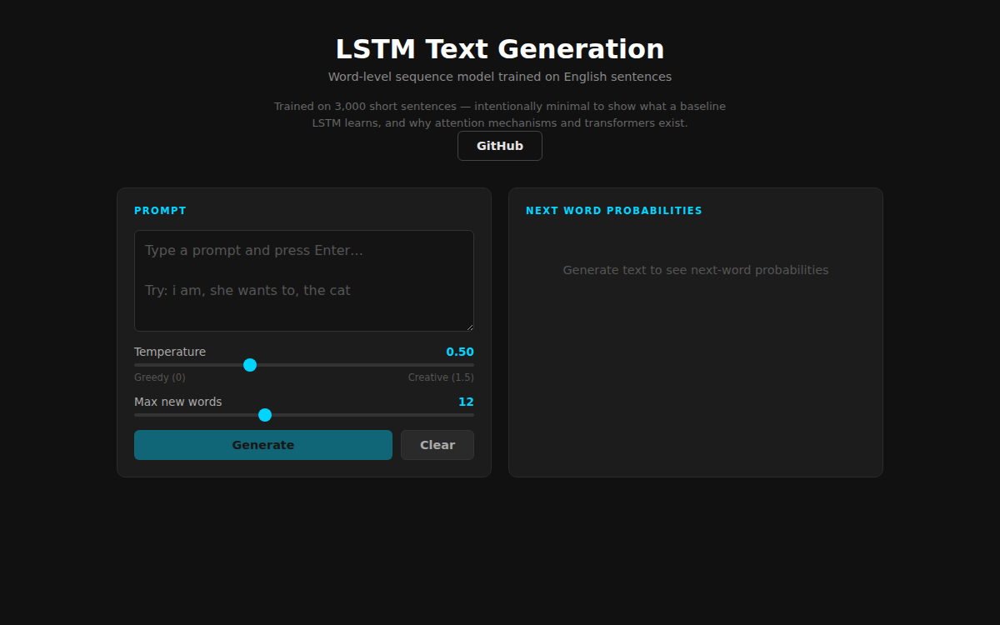

# LSTM Text Generation



Word-level sequence model trained on English sentences from the [Tatoeba](https://tatoeba.org/) bilingual corpus. Built from scratch in PyTorch to explore the mechanics of sequence modeling — one-hot encoding, hidden state propagation, and temperature-controlled generation — before reaching for higher-level abstractions.

---

## Architecture

| Component | Detail |
|---|---|
| Input | One-hot encoded words (vocab size + 1 EOS index) |
| LSTM | 2 layers, hidden size 128, 30% inter-layer dropout |
| Output | Linear projection → vocabulary logits |
| Regularization | Dropout + Adam weight decay (λ = 0.01) |
| LR schedule | Exponential decay, γ = 0.95 per epoch |
| Parameters | 1,900,511 trainable |
| Vocabulary | 2,654 unique tokens |

One-hot input (rather than a learned embedding) makes the vocabulary bottleneck explicit in the parameter count and keeps the information flow easy to reason about.

---

## Results

Trained on 3,000 sentences (1k train / 1k val / 1k test), 10 epochs on GPU:

| Split | Final Loss | Perplexity |
|---|---|---|
| Train | 5.36 | 212 |
| Val | 5.70 | 298 |
| Test | 5.69 | 295 |

Val/test loss plateaus while train loss keeps declining — the gap is expected at this corpus size (3,000 sentences is genuinely small). The perplexity gap between train and val is the clearest signal that a larger dataset or embedding-based input would be the next lever.

---

## Visualizations

The notebook produces four types of plots after training:

**Training curves** — loss and perplexity per epoch across all three splits, showing where overfitting begins.

**Vocabulary frequency** — top-25 words in the corpus; grammatical function words dominate, which is typical for English and explains why the model's greedy outputs skew toward high-frequency words.

**Next-word prediction bar chart** — for any prompt, plots the model's softmax distribution over the top-10 predicted next words. This is the clearest window into what word co-occurrence patterns the LSTM captured.

**Hidden state magnitude heatmap** — L2 norm of the top-layer hidden state at each word position. Spikes indicate timesteps where the model updates its representation strongly.

---

## Generation

`temperature=0` uses greedy argmax; higher values sample from the softmax distribution. With a 3,000-sentence corpus the outputs are limited, but the temperature effect is observable:

```text
Prompt: 'i am'
  greedy    : i am to to
  temp=0.5  : i am was the
  temp=1.0  : i am most keys his but

Prompt: 'she is'
  greedy    : she is to to
  temp=1.0  : she is it him her lucky you of
```

Greedy decoding collapses to high-frequency words ("to", "the") quickly — a good illustration of why temperature sampling and beam search exist.

---

## Setup

```bash
git clone <repo-url>
cd lstm-text-prediction
pip install torch matplotlib scikit-learn numpy
jupyter notebook LSTM_Based_Text_Generation_for_Sequence_Learning.ipynb
```

The first cell downloads and extracts the dataset automatically.

---

## Dataset

- **Source**: [Tatoeba Project](https://tatoeba.org/) English-Spanish corpus via [manythings.org](https://www.manythings.org/anki/)
- **Used**: English side only (141,543 sentences total; 3,000 sampled)
- **License**: [CC BY 2.0](https://creativecommons.org/licenses/by/2.0/)
